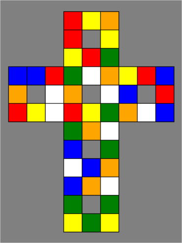
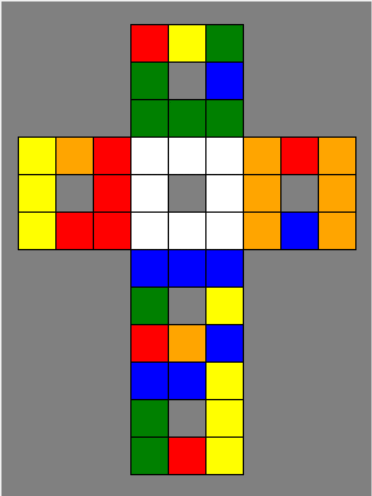
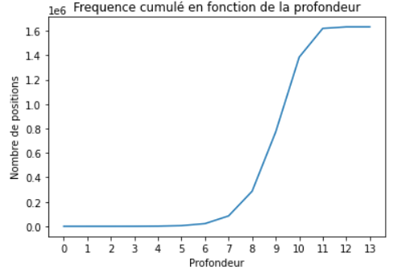

# Exploration Exhaustive du Redi Cube

 

Phase 1             |  Phase 2
:-------------------------:|:-------------------------:
  |  

Ce repository contient tous les codes ayant servi à réalisé une exploration exhaustive du Redi Cube, une variante du Rubik's Cube.
---

## Redi Cube

Il existe de nombreuses variantes du Rubik's Cube, dont la complexité peut être évaluée grâce à une exploration exhaustive de tous les mélanges possibles et à la manière de passer de l'un à l'autre. Un bon exemple est le Rubik's Cube, pour lequel on sait que le "Nombre de Dieu" est de 20, ce qui signifie que tout mélange peut être résolu par une combinaison de 20 mouvements maximum. L'objectif de ce projet est de mener une étude similaire sur une variante récente du Rubik's Cube, le Redi Cube, dont le nombre de Dieu n'est pas encore connu. En plus de l'aspect "exploration exhaustive", on peut s'intéresser à des aspects tels que la recherche de méthodes pour résoudre le Redi Cube et la création d'une interface graphique pour faciliter l'utilisation.

## Méthode

A l'instar de l'algorithme [Two-Phase] de Herbert Kociemba\, il existe un [algorithme de résolution du Redi Cube] exploitant le même principe de résolution en deux phases.* Etat initiale
* Orienter les quatres sommets blancs dans le bon sens.
* Résoudre la face blanche en prenant soin de bien avoir les cubies adjacents au bon endroit (c.f: résoudre la couche adjacente à la face blanche).
* Orienter les sommets de la face opposée (jaune) dans le bon sens.
* Résoudre la couche intermédiaire (c.f.: la couche du milieu).
* Résoudre la face jaune.

Si l'on définit la première phase de l'algorithme de résolution comme étant les trois premières étapes, nous arrivons à séparer le problème en deux sous-problème dont le deuxième comporte un sous ensemble de combinaisons beaucoup plus faible. Le Redi Cube ne sera plus composé que de 8 arêtes et 4 sommets à résoudre.

## Resultats

### Phase 1

La borne supérieur que nous avons estimé lors de cette phase est empririque. Nous avons réalisé une série de 2000 mélanges aléatoires suivi de 2000 résolutions de phase 1. Le nombre maximum de rotation nécessaires afin d'atteindre l'état souhaité a été de 27.

### Phase 2

L'intégralité des états de cette phase sont conservé dans un [fichier de sortie txt]. L'arbre stockant les $10^{6}$ états uniques de cette pahse est un graph de profondeur 13.

L'intégralité des états de la phase deux ont été calculés en 27 heures.
Le nombre de dieux de cette phase, que nous avons exploré de manière exhaustive, est donc de 13.

## Conclusion

Notre méthode par dichotomie nous a permis d'arriver à 2 bornes correspondant au nombre maximum de rotation que l'on doit effectuer afin de résoudre chaque état du Redi Cube. Nous avons pû conclure que la phase 1 pouvait se résoudre en 27 rotations tandis que la phase 2 pourra être résolu en 13 rotations au plus. Ainsi, notre méthode nous a permis de conclure que le Redi Cube peut être résolu en 40 rotations au plus.

[fichier de sortie txt]: https://github.com/Madjakul/ESILV-PTS/tree/main/data
[Two-Phase]: http://kociemba.org/math/twophase.htm
[algorithme de résolution du Redi Cube]: https://jonchammer.com/2020/01/05/redi-cube-solution/